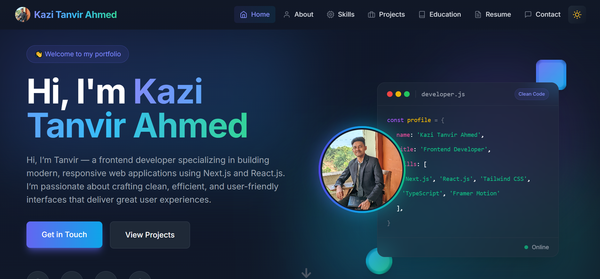

# 🚀 Kazi Tanvir Ahmed | Frontend Developer Portfolio



<div align="center">

[](https://kazi-tanvir-folio.vercel.app/)
[](https://github.com/TanvirCou/portfolio-nextjs)
[](LICENSE)

</div>

## 🎯 Overview

Hi, I'm Tanvir — a frontend developer specializing in building modern, responsive web applications using Next.js and React.js. I'm passionate about crafting clean, efficient, and user-friendly interfaces that deliver great user experiences.

### 🚀 What I Do

- 🌱 Focused on Next.js, React.js, TypeScript, Tailwind CSS, Git and DevOps practices
- ✍️ Love building projects, documenting learning, and teaching through content
- 💻 Specialize in creating responsive, user-friendly web applications
- 🔍 Committed to writing clean, efficient code

## ⚡ Tech Stack

<div align="center">


</div>

### ✨ Key Features

- 🎨 **Modern Design** - Clean, minimalist UI with attention to detail
- 🌗 **Dark/Light Mode** - Seamless theme switching for optimal viewing
- 📱 **Responsive** - Perfect display across all device sizes
- ⚡ **Performance** - Optimized loading and rendering with Next.js
- 🎬 **Animations** - Smooth transitions powered by Framer Motion
- 🔍 **SEO Ready** - Optimized for search engines
- 📝 **Blog Platform** - Integrated blog for sharing insights
- 📂 **Project Showcase** - Filterable portfolio with categories
- 📧 **Contact System** - Professional contact form with EmailJS

## 🚀 Quick Start

1. **Clone the repository**

   ```bash
   git clone https://github.com/TanvirCou/portfolio-nextjs.git
   cd portfolio
   ```

2. **Install dependencies**

   ```bash
   npm install
   ```

3. **Set up environment variables**

   ```bash
   # Create .env.local and add:
   NEXT_PUBLIC_EMAILJS_PUBLIC_KEY=your_key
   NEXT_PUBLIC_EMAILJS_TEMPLATE_ID=your_template
   NEXT_PUBLIC_EMAILJS_SERVICE_ID=your_service
   ```

4. **Start development server**
   ```bash
   npm run dev
   ```

## 📁 Project Structure

```
portfolio/
├── src/
│   ├── app/           # Next.js app routes
│   ├── components/    # Reusable components
│   ├── data/         # Content & configurations
│   ├── lib/          # Utility functions
│   ├── styles/       # Global styles
│   └── types/        # TypeScript definitions
├── public/           # Static assets
└── config/           # Project configurations
```

## 🎨 Customization

1. **Personal Information**

   - Edit `src/data/personalInfo.ts`
   - Update social links and bio

2. **Projects & Skills**

   - Modify `src/data/projects.ts`
   - Update `src/data/skills.ts`

3. **Educations**

   - Update `src/data/educations.ts`

4. **Styling**
   - Customize `tailwind.config.js`
   - Modify global styles in `src/styles`

## 🚢 Deployment

### Deploy to Vercel (Recommended)

1. Fork this repository
2. Import to [Vercel](https://vercel.com)
3. Configure environment variables
4. Deploy!

[](https://vercel.com/new/clone?repository-url=https%3A%2F%2Fgithub.com%2FTanvirCou%2Fportfolio-nextjs)

## 🤝 Contributing

Contributions are welcome! Feel free to:

- Open issues
- Submit pull requests
- Suggest improvements

## 📬 Contact & Social

<div align="center">

[](https://www.linkedin.com/in/tnvr-kazi/)
[](https://github.com/TanvirCou)
[](https://www.facebook.com/ahmed.tnvr.999)
[](https://www.instagram.com/tnvr_ahmed)

</div>

## 📄 License

This project is licensed under the MIT License - see the [LICENSE](LICENSE) file for details.

---

<div align="center">

Made with ❤️ by [Kazi Tanvir Ahmed](https://github.com/TanvirCou)

</div>
